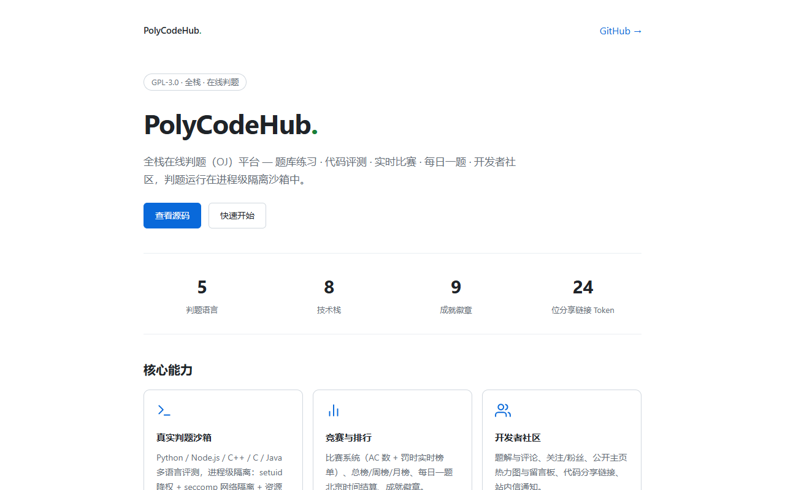

# PolyCodeHub

[简体中文](README.md) | English

[](https://anyuer678.github.io/polycodehub/)
[](LICENSE)
[](https://www.typescriptlang.org/)
[](https://www.python.org/)
[](https://www.java.com/)
[](https://www.docker.com/)
[](https://github.com/anyuer678/polycodehub/actions/workflows/ci.yml)

**A full-stack online judge (OJ) platform** — developer community + code evaluation + leaderboards + admin console + async task pipeline.

Fully usable on the web, covering problem practice, code submission, real-time judging, contests, daily problem, editorial sharing, and community interaction, with judging running in a **process-level isolated sandbox**.

<p align="center"></p>


> **Security boundary note**: the current sandbox uses process-level defense in depth (setuid + seccomp + rlimit + env scrubbing) and is **not container-grade isolation**. seccomp runs in blacklist mode (default allow + blocking 17 classes of dangerous syscalls), not a full whitelist. Hidden test cases are redacted at the API query layer. Do not use it in untrusted multi-tenant scenarios.

## Features

### Judging core
- **Multi-language support** — Python 3 / Node.js / C++ (g++ 14) / C (gcc 14) / Java 21
- **Real judging sandbox** — non-container, process-level isolation:
  - `setuid` drops privileges to a dedicated sandbox user + clears supplementary groups
  - **seccomp defense in depth** (17 rules: blocking `AF_INET`/`AF_INET6`/`AF_NETLINK` sockets + `ptrace` + `mount`/`umount2` + `reboot`/`kexec_load` + `io_uring_setup` + `bpf` + `process_vm_readv`/`process_vm_writev` + `userfaultfd` + `perf_event_open` + `acct`/`ioperm`/`iopl` + `swapon`/`swapoff`)
  - Resource limits (virtual memory / CPU / file size / process count / file descriptors)
  - Environment variable scrubbing (credentials invisible) and tightened `site-packages` permissions
  - Per-child peak memory accounting (`__SB_RUSAGE__`), eliminating false MLEs caused by cumulative values
  - Malicious programs (sleep loops after closing fds) are terminated by the timeout mechanism and never wedge the Worker
- **Judging state machine** — `PENDING → AC / WA / CE / RE / TLE / MLE`, with idempotent write-back and leaderboard counter linkage
- **Custom dry runs** — run code against custom stdin before submitting
- **Test case management** — single item / bulk JSON import / edit / delete; hidden cases are never returned on non-admin paths

### Platform features
- **Problem set** — difficulty tiers (EASY/MEDIUM/HARD), tags, pagination
- **Leaderboards** — all-time / weekly / monthly (Redis ZSet, automatic fallback to DB on disconnect)
- **Contest system** — create contests, attach problems, auto-association of in-contest submissions, live standings (AC count + penalty)
- **Daily problem** — settled on Beijing-time calendar days, results published, teachers can end early
- **Editorials** — AC'd users publish solutions + review flow + comments
- **Community** — follows/followers, public profile message boards, activity heatmap, achievement badges (9), inbox notifications
- **Code sharing** — submission details become read-only share links with 24-char tokens
- **Public profile module visibility** — each module can be `public / self / hidden`, with data filtered accordingly on delivery
- **Admin console** — problems / cases / contests / daily problem / editorial review / users / announcements / notifications / audit log / stats (role split: admin / teacher)

### Security & engineering
- Auth: JWT (HttpOnly Cookie) + gateway auth-cache (version invalidation + `exp` checks) + login failure lockout
- Auth cache invalidates on logout; auth endpoint rate limiting is `fail-closed` (reject rather than allow when Redis is down)
- Audit logging, unified response envelope (`code + message + requestId + data`), rate limiting, CORS whitelist, Zod input validation
- All credentials via environment variables; `.env` never committed and checked for placeholders at startup

## Tech stack

| Layer | Technology |
|------|------|
| Frontend | Next.js + TypeScript |
| API gateway | Node.js + Express + TypeScript |
| Auth service | Java 21 + Spring Boot |
| Judge service | Python 3.12 + FastAPI + process-level sandbox |
| Database | PostgreSQL 16 |
| Cache | Redis 7 (leaderboards / rate limiting / auth cache) |
| Message queue | RabbitMQ (async judging pipeline) |
| Orchestration | Docker Compose |

## Quick start

### Requirements
- Docker Desktop (with Docker Compose)
- Windows (for the scripts) or any Docker-capable environment

### Option A: one-command start (Windows, recommended)

```powershell
powershell -NoProfile -ExecutionPolicy Bypass -File scripts\start.ps1
# Optional flags:
#   -Rebuild        force image rebuild
#   -NoHealthCheck  skip the post-start health check
#   -SkipEnv        skip .env generation check
```

The script handles: Docker daemon check → generate `infra\docker\.env` (random strong passwords + JWT keys) → `docker compose up -d --build` → health check (up to 120s) → logs into `logs\`.

### Option B: manual commands

```bash
copy infra\docker\.env.example infra\docker\.env
docker compose -f infra/docker/docker-compose.yml --env-file infra/docker/.env up -d --build
```

### Access points

| Service | Address |
|------|------|
| Web | http://localhost:3000 |
| Online preview (GitHub Pages) | https://anyuer678.github.io/polycodehub/ |
| Gateway Health | http://localhost:8080/health |
| Judge API Health | http://localhost:8082/health |
| RabbitMQ management | http://localhost:15672 |

> Note: the auth service (8081) and databases are reachable only inside the container network and are not published to the host (preventing gateway rate-limit bypass).

### Stop & clean up

```powershell
scripts\stop-and-clean.bat   # stop; optionally delete data volumes (wipes data)
scripts\diagnose-env.bat     # environment diagnostics (Docker/ports/Compose)
```

## Async judging pipeline

```
Frontend submits → gateway writes submissions(PENDING) → RabbitMQ enqueue
  → Judge Worker consumes → sandbox judging (multi test case)
  → idempotent write-back + leaderboard counters → frontend polls for results
```

## Project structure

```
polycodehub/
├── apps/
│   └── web/                    # Next.js frontend (problems/judging/contests/community/admin)
├── gateway/
│   └── nest-gateway/           # API gateway (routing/auth/rate limiting/audit/leaderboard/daily settlement)
├── services/
│   ├── auth-service-java/      # auth service (register/login/JWT)
│   └── judge-service-python/   # judge API + Worker + sandbox (sandbox_helper + sandbox_netblock)
├── infra/
│   ├── docker/                 # Docker Compose orchestration
│   └── sql/                    # DB initialization and seed data
├── scripts/                    # start/stop/diagnose scripts
├── FIX_LOG.md                  # fix log (28 rounds)
└── LICENSE                     # GPL-3.0
```

## Disclaimer

This project is provided "AS IS" under the **GPL-3.0** license; the author and contributors are **not liable for any direct, indirect, incidental, or consequential damages** arising from its use, including but not limited to business failures, data loss, service outages, or security incidents in real production or living environments. If you intend to use this project in production or business scenarios, assess the risks yourself and **modify the code as needed to fit your requirements**; any impact caused by using this project (including modified versions) is borne by the user.

**Security statement**: the judging sandbox uses process-level defense in depth (setuid + seccomp blacklist + rlimit) and is **not container-grade isolation**; it has not been audited against a production multi-tenant threat model. Hidden test cases are redacted at the API query layer but retained in the database for admin audit. Self-built security mechanisms must be independently evaluated against your actual deployment scenario.

## License

[GPL-3.0](LICENSE) — Copyright (C) 2026 PolyCodeHub Team


## Deployment modes

- Demo: `infra/docker/docker-compose.yml` (may expose debug ports)
- **Production-oriented baseline**: `infra/docker/docker-compose.prod.yml` — DB/Redis/RabbitMQ/Auth not published to the host; Web/Gateway bind to 127.0.0.1 only
- See [infra/docker/README-prod.md](infra/docker/README-prod.md)
